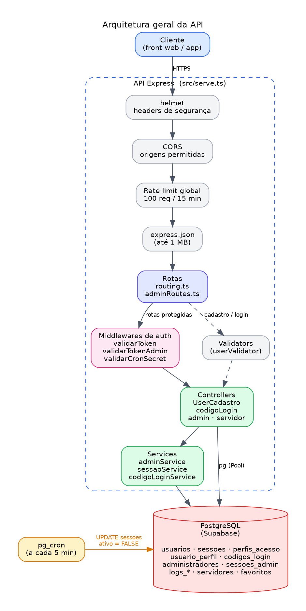
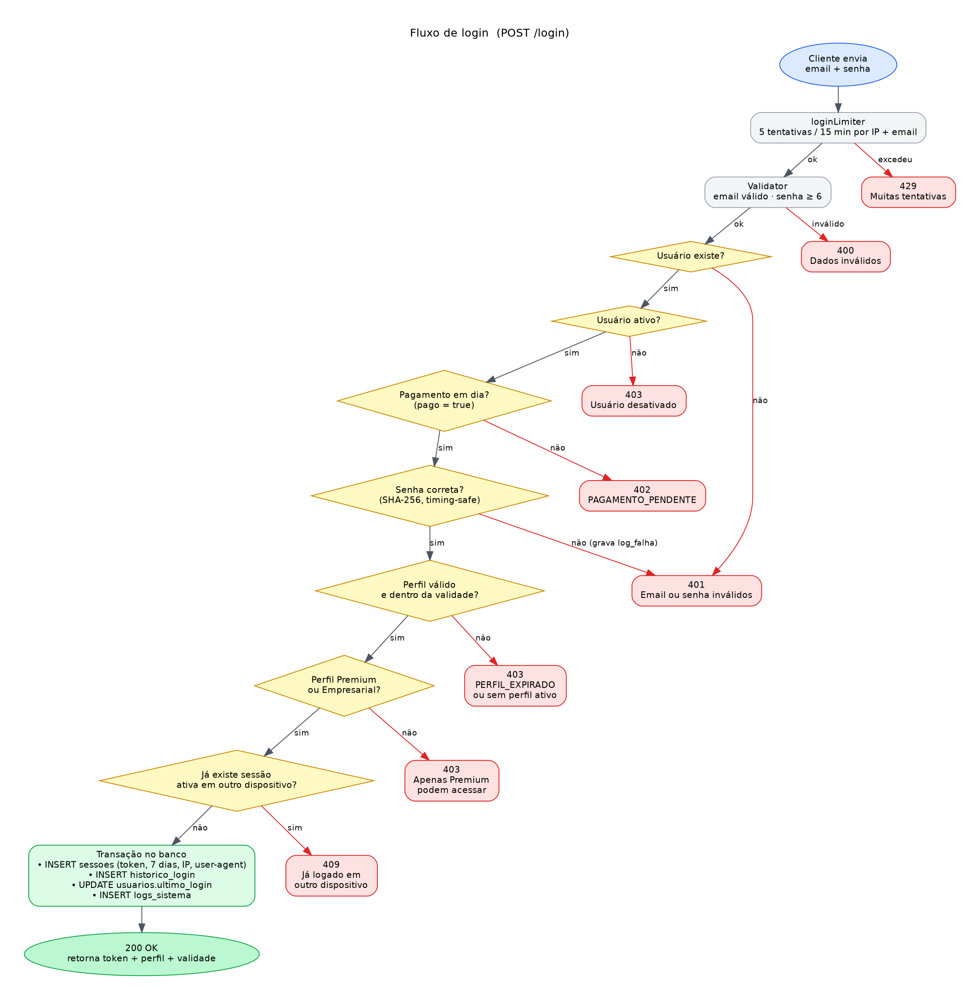
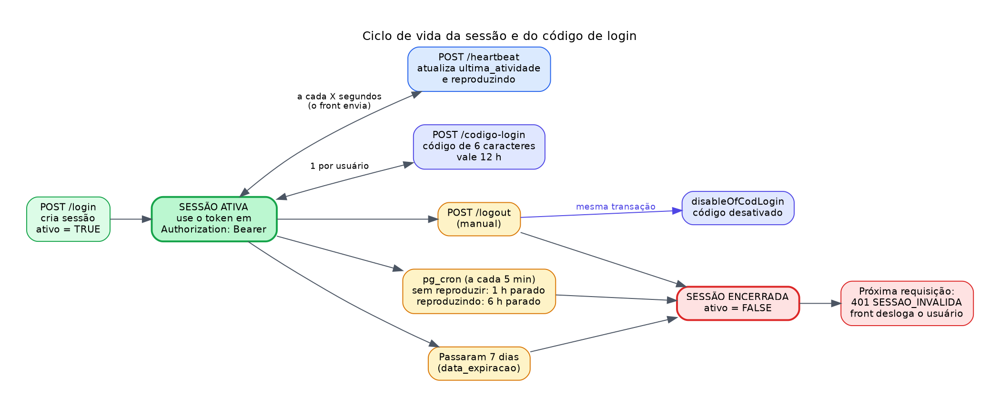
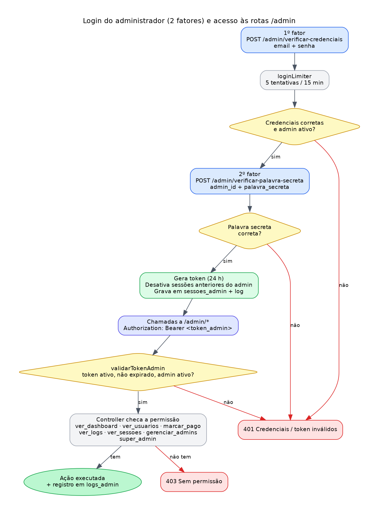

# Back-end Stream

API REST de **autenticação, controle de sessões e gestão de acesso** para plataformas de vídeo sob demanda, feita com **Node.js, TypeScript, Express e PostgreSQL**.

A API cuida de quem pode entrar, por quanto tempo, em quantos dispositivos e com quais permissões. Ela **não armazena nem entrega vídeos**: o catálogo de conteúdo fica fora deste projeto.

---

## Sumário

1. [O que a API faz](#1-o-que-a-api-faz)
2. [Tecnologias e dependências](#2-tecnologias-e-dependências)
3. [Como funciona](#3-como-funciona)
4. [Estrutura do projeto](#4-estrutura-do-projeto)
5. [Pré-requisitos](#5-pré-requisitos)
6. [Instalação e execução local](#6-instalação-e-execução-local)
7. [Configuração do projeto](#7-configuração-do-projeto)
8. [Referência da API](#8-referência-da-api)
9. [Segurança](#9-segurança)
10. [Deploy na Vercel](#10-deploy-na-vercel)
11. [Solução de problemas](#11-solução-de-problemas)
12. [Limitações conhecidas e próximos passos](#12-limitações-conhecidas-e-próximos-passos)

---

## 1. O que a API faz

| Área | Funcionalidades |
|---|---|
| **Usuários** | Cadastro, login, logout e validação de token |
| **Sessões** | Uma sessão ativa por usuário, expiração em 7 dias, *heartbeat* e logout automático por inatividade |
| **Perfis de acesso** | Perfis com validade (`Premium`, `Empresarial`); só eles conseguem entrar |
| **Pagamento** | Login bloqueado enquanto o usuário não estiver com `pago = true` |
| **Código de login** | Um código de 6 caracteres por usuário, válido por 12 horas, desativado no logout |
| **Favoritos** | Lista, adiciona e remove itens favoritos do usuário |
| **Servidores** | Cadastro de servidores (nome, URL, plano `free` ou `vip`) e listagem pública dos ativos |
| **Painel admin** | Login em 2 fatores, permissões por ação, gestão de usuários, admins, sessões e logs |
| **Auditoria** | Registro de ações em `logs_sistema`, `logs_admin` e `historico_login` |

---

## 2. Tecnologias e dependências

**Stack:** Node.js · TypeScript · Express 5 · PostgreSQL (Supabase) · Vercel

Tudo é instalado com `npm install`.

| Pacote | Para que serve |
|---|---|
| `express` | Servidor HTTP e rotas |
| `pg` | Conexão com o PostgreSQL (pool de conexões) |
| `helmet` | Headers HTTP de segurança |
| `cors` | Controle de origens permitidas |
| `express-rate-limit` | Limite de requisições (anti força bruta) |
| `dotenv` | Leitura do arquivo `.env` |
| `typescript`, `tsx`, `ts-node`, `nodemon` | Compilação e execução em desenvolvimento |
| `@types/*` | Tipagens do TypeScript |

---

## 3. Como funciona

### 3.1 Arquitetura

Toda requisição passa por uma fila de proteções (helmet, CORS, rate limit e leitura do JSON) antes de chegar nas rotas. As rotas protegidas passam por um middleware de autenticação e só então chegam ao controller, que usa os services para falar com o banco.



### 3.2 Fluxo de login

O login valida o usuário em etapas, **nesta ordem**: existe, está ativo, pagamento em dia, senha correta, perfil válido, perfil Premium ou Empresarial e nenhuma sessão ativa em outro dispositivo. Cada falha devolve um status HTTP próprio.



| Status | Quando acontece |
|---|---|
| `200` | Login feito, retorna o token |
| `400` | E-mail ou senha em formato inválido |
| `401` | Usuário não existe ou senha incorreta (mesma mensagem, para não revelar qual) |
| `402` | `PAGAMENTO_PENDENTE` |
| `403` | Usuário desativado, `PERFIL_EXPIRADO`, sem perfil ativo ou perfil não permitido |
| `409` | Já existe uma sessão ativa em outro dispositivo |
| `429` | Mais de 5 tentativas em 15 minutos |

### 3.3 Ciclo de vida da sessão

Após o login, o front envia o token no header `Authorization: Bearer <token>` e chama `POST /heartbeat` periodicamente (sugestão: a cada 30 a 60 segundos), informando se o usuário está reproduzindo algo.

A sessão termina por um destes caminhos:

1. **Logout manual** (`POST /logout`)
2. **Inatividade**, tratada por um job no banco (`pg_cron`) que roda a cada 5 minutos:
   - sem reproduzir: **1 hora** sem heartbeat
   - reproduzindo: **6 horas** sem heartbeat (rede de segurança caso o front trave)
3. **Expiração natural**, 7 dias após o login

Quando a sessão é encerrada, a próxima chamada do front recebe `401` com `codigo: "SESSAO_INVALIDA"`, e é assim que o front sabe que deve deslogar o usuário.



### 3.4 Código de login

`POST /codigo-login` gera um código de **6 caracteres** (letras e números sem os confusos `0`, `O`, `1`, `I`, `L`) e o guarda na tabela `codigos_login`.

- Cada usuário tem **no máximo um código**, e cada código pertence a **um único usuário** (garantido por `UNIQUE` no banco).
- Se o usuário já tem um código válido, a API devolve o mesmo (status `200`) em vez de criar outro.
- O código vale **12 horas** e é desativado no logout pela função `disableOfCodLogin`, na mesma transação que encerra a sessão.
- Todas as rotas exigem o token do usuário. O `usuario_id` vem sempre do token, nunca do corpo da requisição.

### 3.5 Painel administrativo

O login do admin tem **2 fatores**: primeiro e-mail e senha, depois uma palavra secreta. Só então é gerado um token com validade de 24 horas, e as sessões anteriores daquele admin são desativadas. Cada rota `/admin/*` confere a **permissão** necessária.



Permissões usadas pelo código: `super_admin`, `ver_dashboard`, `ver_usuarios`, `marcar_pago`, `ver_logs`, `ver_sessoes` e `gerenciar_admins`.

---

## 4. Estrutura do projeto

```
back-end-stream/
├── docs/img/                      # Fluxogramas (PNG) usados neste README
├── scripts/
│   └── gerar-hash.js              # Gera o hash SHA-256 de senha / palavra secreta
├── sql/
│   ├── schema.sql                 # Tabelas do banco
│   ├── seed.sql                   # Perfis e permissões iniciais
│   ├── codigos_login.sql          # Tabela do código de login
│   └── cron_limpeza.sql           # Job de logout por inatividade (pg_cron)
├── src/
│   ├── controller/
│   │   ├── UserCadastroController.ts   # Cadastro, login, logout, token, favoritos, heartbeat
│   │   ├── codigoLoginController.ts    # Rotas do código de login
│   │   ├── adminController.ts          # Painel administrativo
│   │   └── servidorController.ts       # CRUD e listagem de servidores
│   ├── database/connection.ts     # Pool do PostgreSQL, query() e transaction()
│   ├── middlewares/
│   │   ├── auth.ts                # validarToken (usuário)
│   │   ├── adminAuth.ts           # validarTokenAdmin, permissões e validarCronSecret
│   │   ├── cors.ts                # Origens permitidas
│   │   └── rateLimit.ts           # Limites de requisição
│   ├── routing/
│   │   ├── routing.ts             # Rotas de usuário
│   │   └── adminRoutes.ts         # Rotas /admin e /servidores
│   ├── services/
│   │   ├── adminService.ts        # Regras do admin (2FA, sessões, logs)
│   │   ├── codigoLoginService.ts  # Gerar, consultar e desativar código
│   │   ├── sessaoService.ts       # Limpeza de sessões inativas (via rota de cron)
│   │   └── authService.ts         # Não utilizado no momento
│   ├── types/                     # Interfaces TypeScript
│   ├── utils/crypto.ts            # SHA-256, tokens, comparações seguras
│   ├── validators/userValidator.ts
│   ├── serve.ts                   # Monta o app Express (exportado, usado pela Vercel)
│   └── server.ts                  # Sobe o servidor (app.listen) para rodar localmente
├── dist/                          # Saída do build (npm run build)
├── .env.exemple                   # Modelo das variáveis de ambiente
├── package.json
├── tsconfig.json
└── vercel.json
```

---

## 5. Pré-requisitos

- **Node.js 18 ou superior** (testado com a versão 22) e npm
- Um banco **PostgreSQL**. O projeto foi feito para o **Supabase**, e a conexão exige SSL
- Um cliente HTTP para testar: Postman, Insomnia, Thunder Client (VS Code) ou `curl`
- Opcional: conta na **Vercel** para o deploy

---

## 6. Instalação e execução local

```bash
# 1. Entre na pasta e instale as dependências
cd back-end-stream
npm install

# 2. Crie o seu arquivo de variáveis de ambiente
cp .env.exemple .env          # no PowerShell: Copy-Item .env.exemple .env

# 3. Edite o .env e preencha DATABASE_URL (veja a seção 7)

# 4. Crie as tabelas no banco (seção 7.2) e depois rode:
npm run dev
```

Saída esperada:

```
[API] Rodando em http://localhost:3000
[API] Ambiente: development
```

Teste se está no ar:

```bash
curl http://localhost:3000/health
```

```json
{ "status": "online", "timestamp": "2026-10-07T22:03:06.697Z", "versao": "1.0.0", "ambiente": "development" }
```

### Scripts

| Comando | O que faz |
|---|---|
| `npm run dev` | Sobe o servidor com recarga automática (`tsx watch src/server.ts`) |
| `npm run build` | Compila o TypeScript para a pasta `dist/` |
| `npm start` | Roda a versão compilada (`node dist/server.js`). Rode `npm run build` antes |
| `npx tsc --noEmit` | Só confere os tipos, sem gerar arquivos |

---

## 7. Configuração do projeto

### 7.1 Variáveis de ambiente (`.env`)

| Variável | Obrigatória | Descrição |
|---|---|---|
| `DATABASE_URL` | **Sim** | String de conexão do PostgreSQL (Supabase: *Project Settings → Database → Connection string*) |
| `NODE_ENV` | Recomendada | `development` ou `production`. Em produção, erros internos não vazam detalhes |
| `PORT` | Não | Porta local. Padrão `3000`. Na Vercel é definida pela plataforma |
| `CORS_ORIGINS` | Não | Origens permitidas separadas por vírgula. Veja a nota abaixo |
| `CRON_SECRET` | Só com cron HTTP | Segredo do header `x-cron-secret` nas rotas `/admin/limpar-inativas` |

> **Atenção:** o `.env` contém credenciais e **nunca deve ser commitado**. Ele já está no `.gitignore`.
>
> As variáveis `JWT_SECRET`, `JWT_EXPIRES_IN`, `RATE_LIMIT_WINDOW`, `RATE_LIMIT_MAX` e `LOG_LEVEL` podem aparecer em ambientes antigos, mas **o código atual não as lê**: os tokens são aleatórios e guardados no banco, e os limites de requisição são fixos em `src/middlewares/rateLimit.ts`.

**Sobre o CORS:** `localhost` (qualquer porta) e qualquer `*.vercel.app` já são aceitos automaticamente. Para liberar outro domínio, ou um app híbrido (Capacitor, Ionic), liste as origens em `CORS_ORIGINS`. Quando essa variável existe, ela **substitui** a lista padrão de `src/middlewares/cors.ts`, então inclua nela o domínio do seu front.

```
CORS_ORIGINS=https://meu-front.com,capacitor://localhost,ionic://localhost
```

Apps nativos (React Native, Flutter, Kotlin, Swift) não são afetados pelo CORS.

### 7.2 Banco de dados

Rode os arquivos SQL, **nesta ordem**, no SQL Editor do Supabase:

| Ordem | Arquivo | O que faz |
|---|---|---|
| 1 | `sql/schema.sql` | Cria todas as tabelas, índices e ativa o RLS |
| 2 | `sql/seed.sql` | Cria os perfis `Premium` e `Empresarial` e as permissões de admin |
| 3 | `sql/codigos_login.sql` | Cria a tabela do código de login |
| 4 | `sql/cron_limpeza.sql` | Agenda o logout automático por inatividade |

**Tabelas principais**

| Tabela | Função |
|---|---|
| `usuarios` | Contas (senha em hash, `ativo`, `pago`) |
| `perfis_acesso` / `usuario_perfil` | Perfis e a validade de cada usuário |
| `sessoes` | Sessões de usuário (token, expiração, `ultima_atividade`, `reproduzindo`) |
| `historico_login` | Entradas e saídas, com duração |
| `codigos_login` | Código de login (1 por usuário) |
| `favoritos_usuarios` | Favoritos |
| `servidores` | Servidores cadastrados (nome, URL, plano) |
| `administradores`, `permissoes_admin`, `admin_permissoes`, `sessoes_admin` | Painel admin |
| `logs_sistema`, `logs_admin` | Auditoria |
| `pagamentos`, `configuracoes_admin` | Pagamentos e configurações |

### 7.3 Logout automático por inatividade

O arquivo `sql/cron_limpeza.sql` usa a extensão **pg_cron** (ative em *Database → Extensions*). Ele roda a cada 5 minutos e desativa:

- sessões sem reproduzir, paradas há mais de **1 hora**
- sessões reproduzindo, paradas há mais de **6 horas**
- sessões com a data de expiração vencida
- códigos de login de usuários que ficaram sem sessão ativa

Para conferir se está rodando:

```sql
SELECT jobid, jobname, schedule, active FROM cron.job;

SELECT status, return_message, start_time
FROM cron.job_run_details ORDER BY start_time DESC LIMIT 10;
```

> **Alternativa:** a rota `GET/POST /admin/limpar-inativas` faz uma limpeza parecida e pode ser chamada por um cron HTTP externo com o header `x-cron-secret`. Cuidado: ela usa os limites de `src/services/sessaoService.ts` (**15 minutos** sem reproduzir, **2 horas** reproduzindo), diferentes dos do `pg_cron`. Use **um** dos dois, ou alinhe os valores.

### 7.4 Criar o primeiro administrador

Não existe rota pública para criar admin (a rota `POST /admin/admins` exige um admin já logado), então o primeiro é criado direto no banco.

**1.** Gere os hashes da senha e da palavra secreta com o script do projeto:

```bash
node scripts/gerar-hash.js "MinhaSenhaForte123"
node scripts/gerar-hash.js "minha palavra secreta"
```

**2.** Rode no SQL Editor, trocando os valores:

```sql
WITH novo AS (
    INSERT INTO administradores (nome, email, senha_hash, palavra_secreta_hash)
    VALUES ('Administrador', 'admin@exemplo.com', '<HASH_DA_SENHA>', '<HASH_DA_PALAVRA_SECRETA>')
    RETURNING id
)
INSERT INTO admin_permissoes (admin_id, permissao_id)
SELECT novo.id, p.id FROM novo, permissoes_admin p;
```

Isso cria o admin com **todas** as permissões. Depois, faça o login em 2 passos (seção 8.3).

> A API remove espaços do texto antes de gerar o hash. Por isso `"minha palavra secreta"` e `"minhapalavrasecreta"` geram o mesmo valor.

### 7.5 Primeiro usuário para testar o login

O login exige um usuário **pago** e com perfil **Premium** ou **Empresarial**. Em desenvolvimento, o cadastro aceita esses campos:

```bash
curl -X POST http://localhost:3000/cadastrar \
  -H "Content-Type: application/json" \
  -d '{"nome_usuario":"Teste","email":"teste@exemplo.com","senha":"123456","perfil":"Premium","pago":true}'
```

---

## 8. Referência da API

**Formato:** JSON. A maioria das respostas segue `{ "status": true|false, "message": "...", "dados": {...} }`. O middleware `validarToken` responde erros como `{ "mensagem": "..." }`.

**Autenticação:** rotas marcadas com 🔒 exigem `Authorization: Bearer <token>`.

**Limites de requisição**

| Escopo | Limite |
|---|---|
| Global | 100 requisições a cada 15 min por IP (`OPTIONS` e `/heartbeat` não contam) |
| Login (usuário e admin) | 5 tentativas a cada 15 min por IP + e-mail |
| Cadastro | 3 por hora por IP |

### 8.1 Geral e autenticação

| Método | Rota | Auth | Descrição |
|---|---|---|---|
| GET | `/` | | Status da API |
| GET | `/health` | | Health check |
| POST | `/cadastrar` | | Cria usuário (`nome_usuario`, `email`, `senha` ≥ 6; opcionais: `perfil`, `pago`) |
| POST | `/login` | | Login (`email`, `senha`). Retorna o token |
| POST | `/logout` | token | Encerra a sessão e desativa o código de login. Token no header ou em `body.token` |
| GET / POST | `/validar-token` | token | Confere se o token ainda vale. Aceita header, `body.token` ou `?token=` |
| POST | `/heartbeat` | token | Atualiza a atividade. Body: `{ "reproduzindo": true }` |
| GET | `/check-pagamento?email=` | | Informa se o e-mail está com pagamento em dia |
| GET | `/servidores?tier=free\|vip` | | Lista os servidores ativos |

**Exemplo: login**

```bash
curl -X POST http://localhost:3000/login \
  -H "Content-Type: application/json" \
  -d '{"email":"teste@exemplo.com","senha":"123456"}'
```

```json
{
  "status": true,
  "message": "Login realizado com sucesso",
  "dados": {
    "usuario": { "id": 1, "nome": "Teste", "email": "teste@exemplo.com" },
    "perfil": "Premium",
    "token": "9f2c...64 caracteres hexadecimais...",
    "expira_em": "7 dias",
    "data_validade": "2026-11-06T22:00:00.000Z"
  }
}
```

**Exemplo: heartbeat**

```bash
curl -X POST http://localhost:3000/heartbeat \
  -H "Authorization: Bearer <token>" \
  -H "Content-Type: application/json" \
  -d '{"reproduzindo": true}'
```

Se a sessão foi encerrada, a resposta é `401` com `"codigo": "SESSAO_INVALIDA"`.

### 8.2 Favoritos e código de login (🔒)

| Método | Rota | Descrição |
|---|---|---|
| GET | `/favoritos` | Lista os favoritos do usuário |
| POST | `/favoritos` | Adiciona (`item_id`, `item_nome`, `item_tipo`). `409` se já existir |
| DELETE | `/favoritos/:item_id` | Remove um favorito |
| POST | `/codigo-login` | Gera o código (`201`) ou devolve o que ainda vale (`200`) |
| GET | `/codigo-login` | Consulta o código ativo (`404` se não houver) |
| POST | `/codigo-login/desativar` | Desativa o código (`disableOfCodLogin`) |

**Exemplo: gerar código**

```bash
curl -X POST http://localhost:3000/codigo-login -H "Authorization: Bearer <token>"
```

```json
{
  "status": true,
  "message": "Codigo gerado com sucesso",
  "dados": {
    "codigo": "K7M2QX",
    "ativo": true,
    "criado_em": "2026-10-07T22:00:00.000Z",
    "expira_em": "2026-10-08T10:00:00.000Z"
  }
}
```

### 8.3 Administração

**Login em 2 passos** (sem token):

```bash
# Passo 1: credenciais. Retorna o admin_id
curl -X POST http://localhost:3000/admin/verificar-credenciais \
  -H "Content-Type: application/json" \
  -d '{"email":"admin@exemplo.com","senha":"MinhaSenhaForte123"}'

# Passo 2: palavra secreta. Retorna o token do admin (24 h)
curl -X POST http://localhost:3000/admin/verificar-palavra-secreta \
  -H "Content-Type: application/json" \
  -d '{"admin_id":1,"palavra_secreta":"minha palavra secreta"}'
```

**Rotas protegidas** (🔒 token do admin):

| Método | Rota | Descrição |
|---|---|---|
| GET | `/admin/dashboard` | Indicadores gerais |
| GET | `/admin/usuarios` | Lista usuários |
| PUT | `/admin/marcar-pago/:id` | Marca o usuário como pago |
| PUT | `/admin/desmarcar-pago/:id` | Remove o pagamento |
| DELETE | `/admin/usuarios/:id` | Exclui o usuário (e seus dados) |
| GET / POST | `/admin/servidores` | Lista e cria servidores |
| GET / PUT / DELETE | `/admin/servidores/:id` | Busca, atualiza e remove um servidor |
| GET | `/admin/permissoes` | Lista as permissões disponíveis |
| GET / POST | `/admin/admins` | Lista e cria administradores |
| GET / PUT / DELETE | `/admin/admins/:id` | Busca, atualiza e remove um admin |
| GET | `/admin/logs` | Logs do sistema |
| GET | `/admin/logins` | Histórico de logins |
| GET | `/admin/sessoes` | Sessões de usuário |
| DELETE | `/admin/sessoes/:id` | Revoga uma sessão |
| DELETE | `/admin/admins/:id/sessoes` | Revoga as sessões de um admin |
| POST | `/admin/limpar-inativas-admin` | Limpa sessões de admin inativas |
| POST | `/admin/logout` | Encerra a sessão do admin |

**Rota de cron** (header `x-cron-secret`, sem token): `GET` ou `POST /admin/limpar-inativas`.

---

## 9. Segurança

- **Helmet** adiciona headers de proteção HTTP.
- **CORS** com lista de origens permitidas.
- **Rate limiting** global, por login e por cadastro. O limite de login usa IP + e-mail e trata endereços IPv6 por sub-rede.
- **Tokens aleatórios** (32 bytes) guardados no banco, o que permite revogar qualquer sessão na hora.
- **Consultas parametrizadas:** os valores enviados pelo usuário sempre vão como parâmetros (`$1`, `$2`...), o que previne SQL injection. Os filtros dinâmicos do admin montam apenas fragmentos fixos com placeholders.
- **Comparações em tempo constante** (`timingSafeEqual`) para senha e para o `x-cron-secret`.
- **Mesma mensagem** (`401`) para e-mail inexistente e senha errada.
- **Login de admin em 2 fatores** e permissões por ação.
- **Uma sessão por usuário**, com expiração por tempo e por inatividade.
- **Transações** nas operações que alteram várias tabelas (login, logout, cadastro).
- **RLS ativado** nas tabelas, bloqueando o acesso pela Data API do Supabase. A API acessa o banco por conexão direta.
- **Em produção**, o tratador de erros não expõe detalhes internos.

---

## 10. Deploy na Vercel

O `vercel.json` aponta para `dist/serve.js`, que exporta o app Express sem `listen`.

1. Configure as variáveis de ambiente no painel da Vercel (*Settings → Environment Variables*): `DATABASE_URL`, `NODE_ENV=production`, `CORS_ORIGINS` e, se usar o cron HTTP, `CRON_SECRET`.
2. Como a Vercel executa o `dist/`, **rode `npm run build` e commite a pasta `dist/` antes de cada deploy**. Se esquecer, a produção continua com o código antigo.
3. Faça o push. Teste primeiro em um **branch** (gera um *preview deploy*) antes de ir para o `main`.
4. Confirme com `GET /health` na URL publicada.

---

## 11. Solução de problemas

| Sintoma | Causa provável | Solução |
|---|---|---|
| `Origem bloqueada pelo CORS` (403) | O domínio do front não está permitido | Adicione-o em `CORS_ORIGINS` e faça redeploy |
| `429 Muitas tentativas` | Limite de requisições atingido | Aguarde a janela de 15 min (login) ou 1 h (cadastro) |
| Login `402 PAGAMENTO_PENDENTE` | Usuário com `pago = false` | `PUT /admin/marcar-pago/:id` ou atualize a coluna no banco |
| Login `403 Apenas usuarios Premium` | Sem perfil `Premium`/`Empresarial` ativo | Rode o `seed.sql` e cadastre com `"perfil": "Premium"` |
| Login `409` | Já existe sessão ativa | Faça logout, ou aguarde o job de inatividade encerrar a sessão |
| Erro de SSL ou `ECONNREFUSED` | `DATABASE_URL` incorreta | Confira o usuário, a senha e o host no Supabase |
| `relation "codigos_login" does not exist` | Tabela não criada | Rode `sql/codigos_login.sql` |
| Logout retorna `500` depois de atualizar o projeto | A tabela `codigos_login` ainda não existe | O logout desativa o código na mesma transação: rode `sql/codigos_login.sql` |
| Sessão não cai por inatividade | Job não agendado ou com erro | Veja `cron.job` e `cron.job_run_details` (seção 7.3) |
| `npm run dev` roda e encerra sem subir o servidor | O script aponta para `src/serve.ts`, que só exporta o app | Use `src/server.ts` (já configurado no `package.json`) |

---

## 12. Limitações conhecidas e próximos passos

- [ ] **Hash de senha:** hoje é SHA-256 simples. Migrar para **bcrypt** ou **argon2**, com salt e custo configurável.
- [ ] **Cadastro:** restringir `perfil` e `pago` a fluxos confirmados (pagamento ou admin). Hoje o cadastro os aceita no corpo da requisição, o que serve para desenvolvimento.
- [ ] **`vercel.json`:** remover os headers `Access-Control-Allow-Origin: *`, deixando o CORS só no middleware.
- [ ] **Configuração:** tornar os limites de requisição e os tempos de sessão configuráveis por variável de ambiente.
- [ ] **Inatividade:** unificar as regras do `pg_cron` e do `sessaoService.ts` em um só lugar.
- [ ] **Enumeração de contas:** `/check-pagamento` é público e o login responde `402` e `403` (pagamento e usuário desativado) **antes** de validar a senha, o que revela o estado de uma conta. Proteger a rota e mover a checagem de senha para o início.
- [ ] **Build:** gerar o `dist/` na própria Vercel e tirá-lo do git.
- [ ] **Testes:** ainda não há testes automatizados (unitários e de integração).
- [ ] **Limpeza:** remover `src/services/authService.ts` e os arquivos vazios (`src/controller/payment.ts`, `src/services/servidorService.ts`) ou implementá-los.
